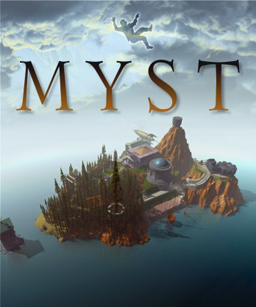

In 1993, [Myst](https://en.wikipedia.org/wiki/Myst) released on Macintosh OS, and later on Windows 3.1. As the player, you explore different worlds and solve environmental puzzles - making *Myst* not too dissimilar from its peers of the time. The thing that struck me the most about it was the deep and rich backstory. In the game, these different worlds that you can visit are written into books. That is, if you create a special kind of book, and use the right ink, you can describe a world that you can then be physically transported to. Imagination crossing over into reality. And these books have rules, which if you don't follow result in instability. **Fissures and decay in the places described within.**

When I first started experimenting with programming computers, first in Basic, then in C++ and other languages, that image of writing worlds into existence always struck me. The act of creation was finally in my grasp. In order to utilize this magic to its fullest extent, I needed to do more than just string together abstract concepts - I needed to understand the pen and paper and ink that I was working with. **To create the best art, one needs to understand the medium.**

That's what programming means to me. A means to create a new reality simply by describing it. And computers are the medium. Over the years I've discovered that I have a knack for computers - I did lock my parents out of their first computer when I was 3, and I've had a certain understanding of them ever since. I can write code as naturally as I can speak english, and given that I know half a dozen programming languages very well, I can pick up new ones quickly. I don't imagine it'll be difficult for me to find work as a software engineer. **But that's not what I want in the long run.**

Since I've studied the field of Computer Engineering in pursuit of my bachelor's degree, I've gained a more detailed understanding of the hardware and low-level software driving computers, and I'm comfortable with higher level abstractions and programming languages, but organizing and driving a long term larger project is a skill that I have yet to develop very well. In part because I've usually worked alone in the past, and in part because I keep losing focus.

The more time I spend away from what initially inspired me, the more I lose faith. I need to create new worlds, and I need a better understanding of the art in order to accomplish that goal. The more diverse experiences I have in the field of software engineering, the closer I get to making it a reality. **To that end, I'm excited to see how I learn and grow into the future.**  

Image credit: [https://en.wikipedia.org/wiki/Myst#/media/File:MystCover.png](https://en.wikipedia.org/wiki/Myst#/media/File:MystCover.png) copyright Cyan Worlds and Brøderbund.
