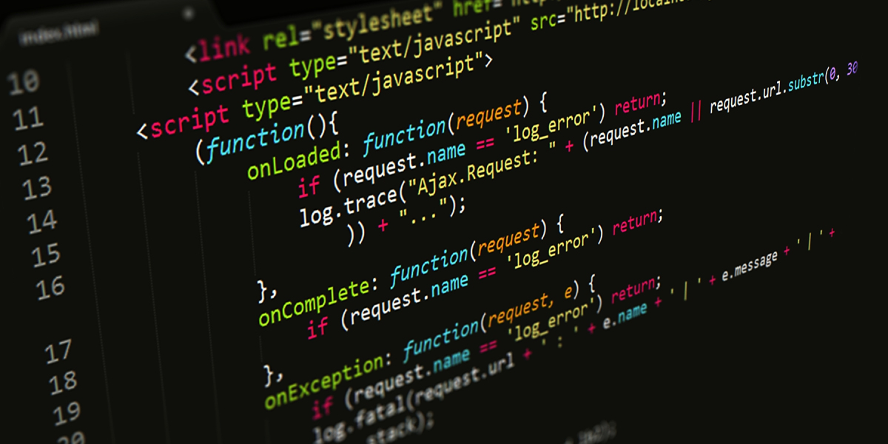

<!-- Image from shutterstock/-->

If you clicked this, you're probably at least considering learning JavaScript, or maybe you're just curious why I think it's a good idea for anyone to learn. I hope that by the end of this post I've at least convinced you to give it a try.

## Near-universal cross-platform support

JavaScript delivers on the promise of true cross-platform support, largely by accident. Back in the 90s when Java was released, it was marketed with the acronym [WORA](https://www.computerweekly.com/feature/Write-once-run-anywhere), which means "Write Once, Run Anywhere". This was based on the fact that Java code compiles into instructions to be executed on the JVM, or Java Virtual Machine. This means that any computer with the JVM installed can run Java programs compiled on any platform.

One major problem with Java, however, is the lack of ubiquity of the JVM. Many users need to install the entire platform just to run one application, and it requires frequent updates to be able to execute the newest Java programs. This additional effort on the part of the user limits the reach and accessibility of the Java programming language.

Enter JavaScript. Formally ECMAScript (named after the European Computer Standards Organization which advanced the language standard), JavaScript shares little more with Java than its name and some of its syntax and features. Rather than providing a virtual machine on which to execute instructions, the ECMAScript standard provides a specification for an interpreted language to be implemented by and executed on web browsers. Because nearly every computer user has a web browser already installed and updated for the purpose of using the internet, this provides a nearly universal execution platform for the JavaScript language. **If the user doesn't have to install anything new to run your program, then the overhead will be invisible to them.**

While JavaScript was initially simply a browser scripting language, it was developed into one of the most widely used and fully featured languages available, with support for everything from hardware-accelerated 3D graphics to advanced data analysis and machine learning tools.

Threre are some differences between browser implementations to consider, and newer features such as the ES6 version of ECMAScript are not as widely supported, but with these minor caveats, JavaScript finally actually delivers on the promise of WORA.

## Powerful and advanced language features

If you don't come from a computer science background, you may not be aware of just how powerful certain language features can be. For example, lambda functions (called 'arrow functions' in JavaScript) don't just provide shorthand for simultaneously defining functions and passing them as data, they allow for other variables in scope to be captured and passed silently as well, leading to much leaner, neater code. 

Other features include asychronous code execution and template strings, among many more. While other modern programming languages such as C++ and Python also have advanced features, **JavaScript maintains a competitive edge, so if you're comfortable with a certain programming style, JavaScript will allow to breathe freely.**

## Extensibility

This is one of the biggest draws for me personally. I was initially put off by JavaScript and its flexibility with regard to syntax and variable typing, since it allows but does not require semicolons, and variable types are determined at runtime and not stirctly enforced. If this sends shivers down your spine, then consider [TypeScript](https://www.typescriptlang.org). TypeScript is built on top of JavaScript (it compiles into pure JavaScript) that adds more Java-style object oriented programming features as well as allowing strict type specifications for variables, function parameters, and classes. The added step of compilation also allows for syntax and type errors to be caught prior to attempted execution, which in my experience makes the development process go more smoothly.

The [Node.js](https://nodejs.org/en/) platform provides an excellent tool for installing JavaScript code from the internet and collecting your own projects into packages. If you're targeting client-side scripts as your end result, then a Node.js project using webpack can bundle up everything into a single .js file that can be downloaded by the end user in one go from a content delivery network. **The flexibility and extensibility I've discovered in JavaScript is truly unparalleled.**

## How can I start?

The best way to start learning any programming language is just to start coding. [JSFiddle](https://jsfiddle.net) provides an easy-to-use environment to support simple to moderately advanced web apps, with windows to input HTML, CSS, JavaScript, and the resulting display and console output. Start by building a pared down version of something you want to make and work up from there. The sky's the limit!

One fun thing you can try to measure your progress is completing the same project from scratch multiple times, timing yourself each time. If you're seeking a job in software engineering, this will help you to practice for timed coding interviews, as well as helping you get to the point where you can write code as naturally as you can speak your native language.  
  