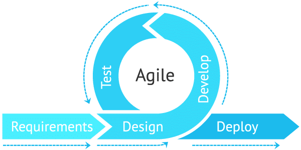

Over the course of my formal education, I've learned many algorithms, techniques, and details. How to use Git, Vim, or Visual Studio. Functional programming, design patterns, coding standards. All of this is useful, sure, but it's also stuff I picked up myself pretty quickly as soon as I began to dabble in programming. One thing that always proved challenging, however, was learning to work in groups on small projects. My hobby development focused on smaller personal projects, so I naturally approached group projects the same way. We would collaborate on GitHub, make separate branches, and delegate work, but it always became an entangled mess of merge conflicts and bugs. One person would add functionality to a shared part of code, breaking functionality in another part that someone else adds. Essentially, at least one member of the team would have to refactor the entire thing just to get all of the functionality in, and many many times it would be easier to code the whole thing myself than to try and integrate the changes everyone made without breaking anything.

Finally, in my senior year of my Computer Engineering degree, I've been presented with the right tools to manage group projects so our efforts can be organized and combined effectively without constantly working against each other. Those tools were Agile Project Management and Continuous Integration.

Image credit: [https://hive.com/blog/what-is-agile-project-management-methodology/](https://hive.com/blog/what-is-agile-project-management-methodology/)