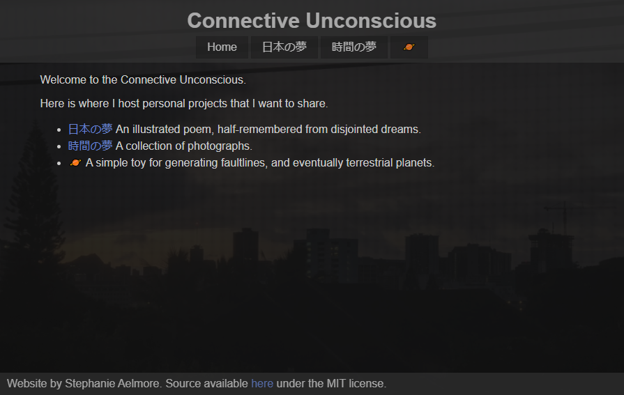
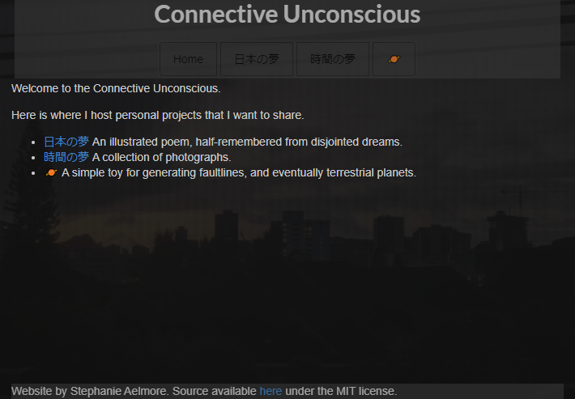

## Front-end design

The front-end of a webpage can be one of the most challenging platforms to design for. Many fonts and features are not supported uniformly among browsers, and users expect websites to be compatible with input from a mouse, a keyboard, or touchscreen, and able to cater to the nuances of each input method. Devices have widely different pixel density and aspect ratios. Although HTML and CSS have many built-in features to cater to such variance, when designing more complex functionality the amount of work necessary can quickly grow out of control.

A UI framework such as [Semantic-UI](https://semantic-ui.com) or [Twitter Bootstrap](https://getbootstrap.com) can streamline this process. These frameworks provide the ability to design customizable pages with advanced features with little effort from the user, aside from the initial difficulty curve of learning the framwork itself. There is a downside to this approach, however, and that is if you wish to create a page with a very specific look and feel that does not fit into the set of use cases that the creators of the framework imagined.

For my personal website, I had a very specific look and feel in mind, and while it is not quite as flexible as a webpage created in Semantic-UI, it looks and functions exactly as I envisioned.

## A comparison

  

    
  

  

    
  

On the left is my homepage looking and functioning exactly as I intend, and on the right is my attempt at porting the page to use Semantic-UI. I don't mean this as a criticism of Semantic-UI, as I'm sure with more tuning and effort I could get it very close to what I created with pure HTML and CSS, but this serves as an example to showcase just how much formatting the framwork does under the hood, which would need to be identified and corrected with additional lines of css to override them and realize the original design.

## Verdict

For my purposes, the choice is clearly to use pure HTML and CSS, but if I were to design something more interactive and user-focused I would lean towards an HTML5 canvas with a JavaScript GUI and WebGL graphics before I would resort to using a framework such as Semantic-UI. There's clearly a lot of work and impressive design that went into making them easy to use, but they don't offer the level of fine-grained control that I want without demanding more work than they would ultimately save.

Perhaps in the future I will reconsider this decision, but for now I am happy with my choice to build from the ground up in HTML and CSS.