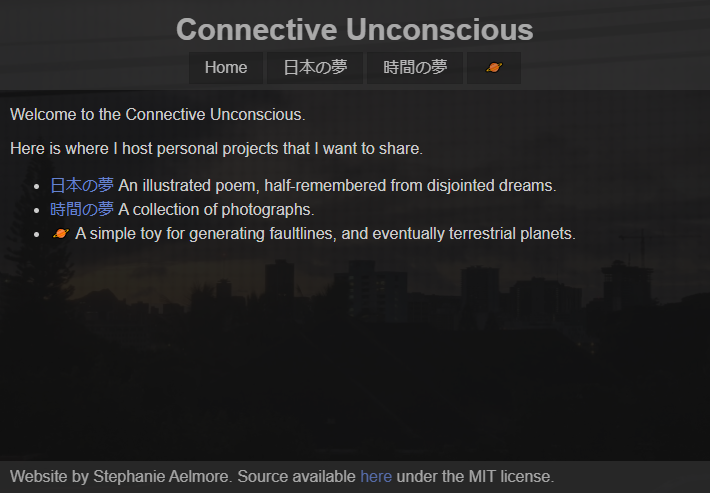

<!-- UI Frameworks are not simple. In fact, they can be almost as complicated to learn as a new programming language. Given that, why bother to use something like Semantic UI? What does one get in return for the investment of time and frustration? Why not just use raw HTML and CSS? Are the software engineering benefits of UI frameworks?

For this assignment, create an engaging and informative essay about UI Frameworks. You might want to discuss some of the issues raised above, as well as your own personal experience with Semantic UI. Or perhaps you’ve also used another framework such as Twitter Bootstrap. In that case, it might be interesting to read your perspective on a comparison of the two.

This essay is tailor made to include an image of a web page built with a UI framework (or even a comparison of web pages built with and without a UI framework).

Feel free to go in another direction entirely, as long as you are discussing UI Frameworks, and as long as the result is interesting, informative, and insightful. Write for the world! -->

The front-end of a webpage can be one of the most challenging platforms to design for. Many fonts and features are not supported uniformly among browsers, and users expect websites to be compatible with input from a mouse, a keyboard, or touchscreen, and able to cater to the nuances of each input method. Devices have widely different pixel density and aspect ratios. Although HTML and CSS have many built-in features to cater to such variance, when designing more complex functionality the amount of work necessary can quickly grow out of control.

A UI framework such as [Semantic-UI](https://semantic-ui.com) or [Twitter Bootstrap](https://getbootstrap.com) can streamline this process. These frameworks provide the ability to design customizable pages with advanced features with little effort from the user, aside from the initial difficulty curve of learning the framwork itself. There is a downside to this approach, however, and that is if you wish to create a page with a very specific look and feel that does not fit into the set of use cases that the creators of the framework imagined.

For my personal website, I had a very specific look and feel in mind, and while it is not quite as flexible as a webpage created in semantic-ui, it looks and functions exactly as I envisioned.

  

    
  

  

    
  

