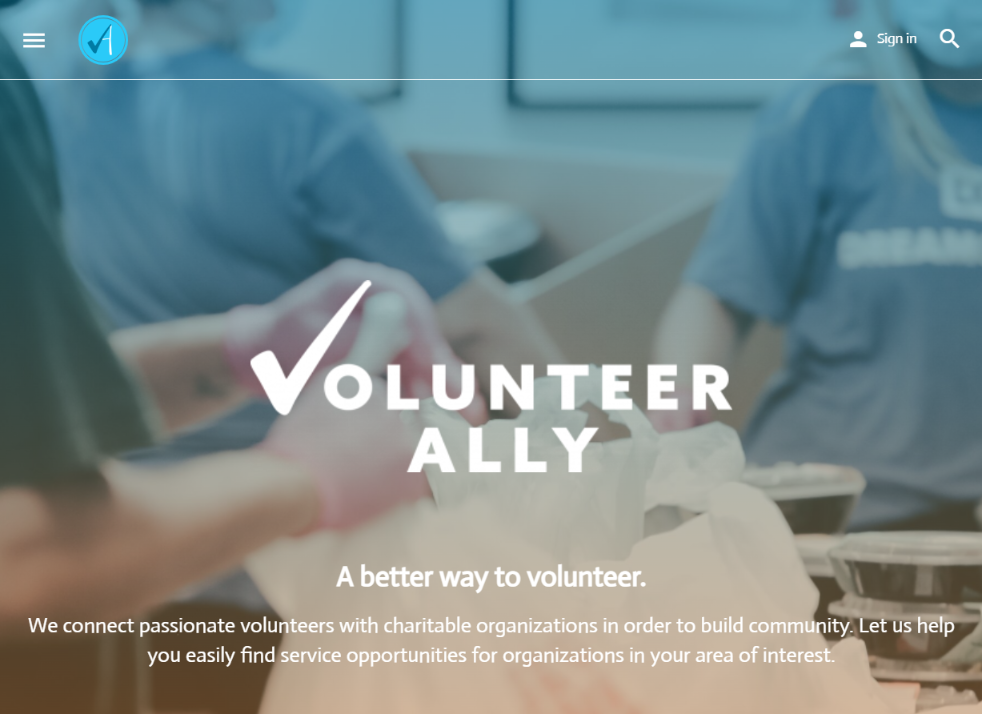

For Software Engineering II (ICS 414) at the University of Hawaii at Manoa, I joined a group of five other students to develop a Meteor-based web app for the organization [Volunteer Ally](http://volunteerally.com) based in Hawaii. Volunteer Ally matches volunteers with nonprofits and organizations with a presence here, serving a similar function to websites such as [VolunteerMatch](https://www.volunteermatch.org). Minimum viable product to be delivered was a site where organizations could log in and post volunteer opportunites, which could be viewed by prospective volunteers. Volunteers could then create an account, contact the organization, and register for specific opportunities and track their completed hours on the site. We started with the Information and Computer Sciences department's Meteor/React template and built the application on GitHub using JavaScript. Over the course of the semester, I gained some valuable experience, and I'll be sharing what I learned in this essay.

## Client Specifications

Since this was my first experience developing software for a client, one of the first lessons was how their needs and expectations evolve over time. They initially provided us with a simple Wordpress blog that emulated the base functionality they wanted to see. This template provided a skeleton for the layout and some basic graphics to get us started. Their initial expectations were lofty, hoping for gamification on top of the base functionality. However, each client meeting, as they saw more of the site in action, they began specifying new and different details, changing the overall trajectory of the project. **In retrospect, it would have been pragmatic to write a complete design document at the outset and walk through it with a client to glean feedback before we began implementation.**

  
Screenshot of the client wordpress site.

## Project Management

Project management was anarchic, which I wanted to try, but I do not believe that it yielded the best results in this case. With no clear delegation of roles or responsibilities, and no clear picture of what the finished product was going to look and work like, we each set out to implement different parts of the application using different approaches that did not always work well together.

## Continuous Integration
