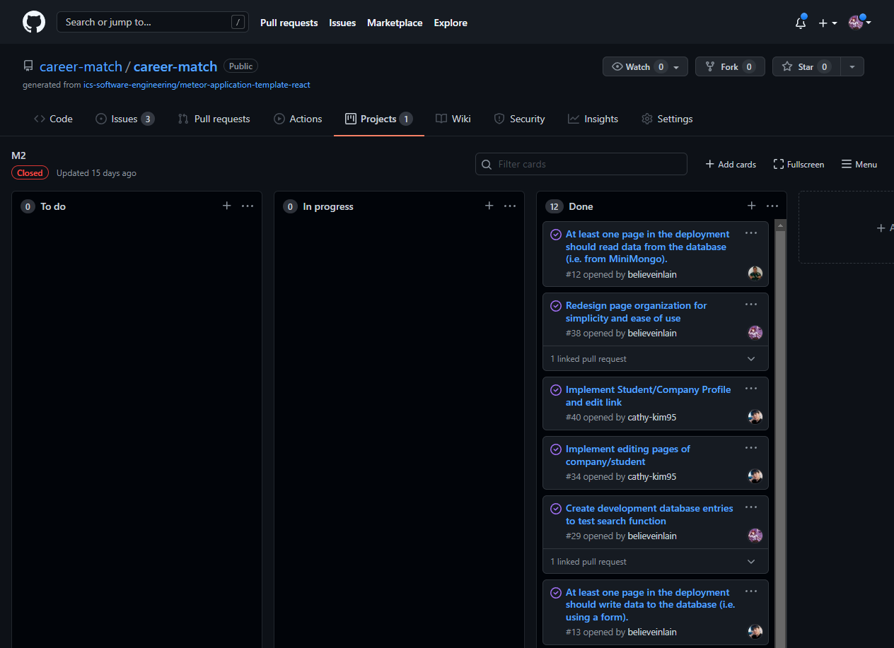

UH Career Match is a web app I developed along with my classmates for ICS 314: Software Engineering I, at UH Manoa. To accomplish this project, we used the [Meteor Framework](https://www.meteor.com) along with [React](https://reactjs.org), [Semantic UI](https://semantic-ui.com), and [MongoDB](https://www.mongodb.com).

For project management, we used issue-driven development with Github. I played the role of project manager, identifying tasks to meet our milestone requirements and creating an issue for each one.

The team worked together to implement the features necessary to address and close each issue. I was responsible for identifying and correcting each of the following issues:
- Deploy app to Digital Ocean
- Update github.io page with links as required
- Redesign page organization for simplicity and ease of use
- Create development database entries to test search function
- Put your system under contiguous integration using GitHub Actions.
- Update your organization’s GitHub Page to document the current version of your system following GitHub hosting guidelines.
- Fix routing for implemented pages
- Implement TestCafe “availability” tests for all pages.
- Display the current results of continuous integration via a badge on your project home page.
- Update career-match.github.io with latest changes to close out module 2
- Refactor to simplify profile/account association and fix bugs for deployment

As evidenced by the issues I closed, I managed deployment and continuous integration, and played a part in application design, database management, and documentation.

Career Match was developed in collaboration with Cathy Kim, Gerald Lee, Ian Eshelman, and Jay Ramos. Read more about the project [here](https://career-match.github.io). Source code for the project can be found [here](https://github.com/career-match).
