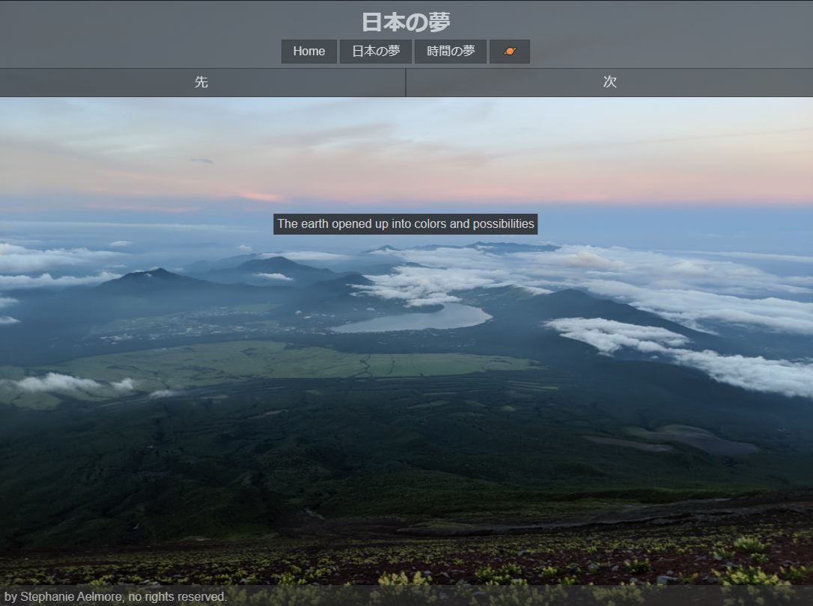

The [Connective Unconscious](http://connectiveunconscious.com/) is my personal website that I host on an Ubuntu Server so that I have full control over the design and execution of everything hosted on it. So far I've only seen fit to host photos, poetry, and an unfinished applet that I wrote about [here](/projects/planetgen).

Source code is available [here](https://github.com/believeinlain/connectiveunconscious).
