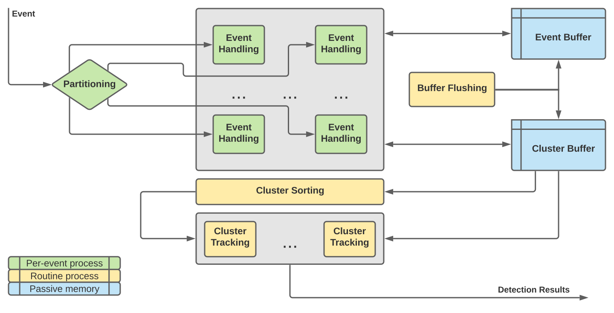

[Event cameras](https://en.wikipedia.org/wiki/Event_camera) are cameras that only capture changes in intensity rather than periodically capturing an entire frame. This gives them the advantage of extremely low latency and extremely high power efficiency over conventional cameras. The difficulty is that due to the event-based data they output, conventional computer vision approaches cannot be directly applied when working with event cameras.

  
Events representing changes in brightness as boats moving through a harbor. Note the high density of events produced by waves, which we are not interested in tracking.

  
Events on top of conventional frames captured, with annotations highlighting objects of interest.

  
Resulting output from the Persistent Motion Detector, with estimated velocities and confidence based on motion analysis of tracked clusters.

The Persistent Motion Detector is written in C++ and loaded as a Python extension to provide an easy-to-use frontend for development and interfacing with other Python libraries for event-based data processing.

## Overview of the Persistent Motion Detector algorithm

Source code is available [here](https://github.com/believeinlain/asynch-cv).

## Acknowledgements

Submitted to [AIPR Workshop](https://www.aipr-workshop.org) 2021 with the title *Real-Time Event-Based Tracking and Detection for Maritime Environments*.  

Developed with financial support from University of California San Marcos and Naval Information Warfare Center Pacific.  
